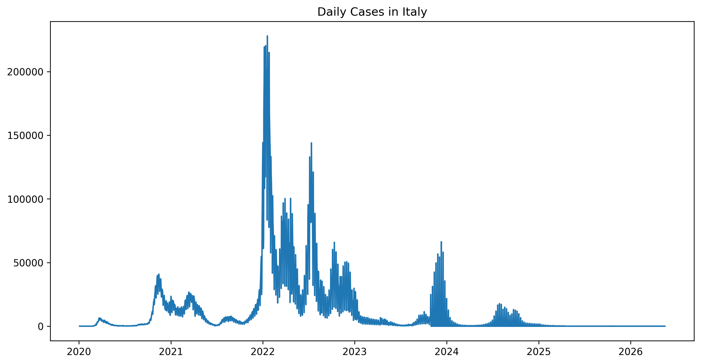
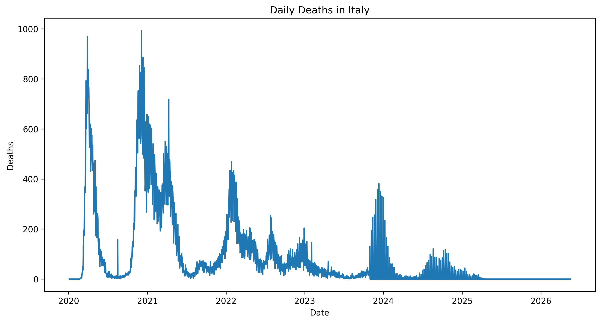
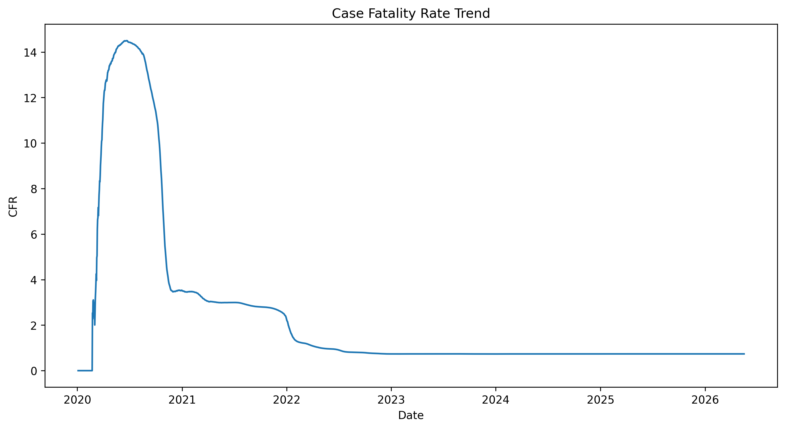
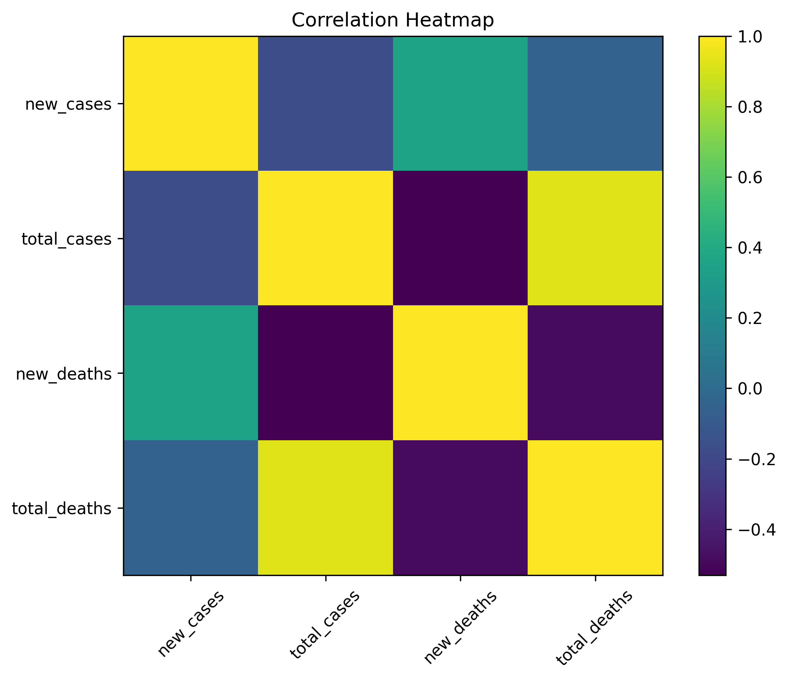

# 🇮🇹 COVID-19 Italy Data Analysis and Trend Investigation

## 📌 Project Overview

This project presents an exploratory data analysis (EDA) of COVID-19 data from Italy, covering the period from January 2020 to May 2026. The objective is to analyze pandemic trends, identify significant outbreaks, examine mortality patterns, and derive meaningful insights from real-world healthcare data.

The analysis utilizes Python and popular data science libraries to clean, explore, visualize, and interpret COVID-19 case and death statistics.

---

## 🎯 Objectives

* Analyze COVID-19 case and death trends in Italy.
* Identify peak infection and mortality periods.
* Examine weekly and biweekly growth patterns.
* Study Case Fatality Rate (CFR) trends over time.
* Visualize pandemic waves using statistical and graphical techniques.
* Extract actionable insights from historical COVID-19 data.

---

## 📊 Dataset Information

The dataset contains daily COVID-19 statistics for Italy, including:

* New Cases
* Total Cases
* New Deaths
* Total Deaths
* Weekly Cases
* Weekly Deaths
* Growth Rates
* Cases per Million
* Deaths per Million
* Case Fatality Rate (CFR)
* 7-Day Moving Averages

### Dataset Statistics

* Records: 2,326
* Time Period: January 2020 – May 2026
* Maximum Daily Cases: 228,123
* Maximum Daily Deaths: 993
* Total Confirmed Cases: ~26.9 Million
* Total Deaths: ~198,000

---

## 🛠 Technologies Used

* Python
* Pandas
* NumPy
* Matplotlib
* Scikit-Learn
* Google Colab

---

## 📈 Exploratory Data Analysis

The following analyses were performed:

### 1. Daily Cases Trend

Visualization of daily reported COVID-19 cases over time.

### 2. Daily Deaths Trend

Analysis of mortality patterns throughout the pandemic.

### 3. 7-Day Moving Average

Smoothing daily fluctuations to reveal long-term trends.

### 4. Correlation Analysis

Investigation of relationships between cases, deaths, and cumulative statistics.

### 5. Case Fatality Rate (CFR)

Evaluation of mortality risk trends during different pandemic phases.

### 6. Monthly Trend Analysis

Aggregation of daily data to identify broader outbreak waves.

---

## 📷 Visualizations

### Daily Cases Trend



### Daily Deaths Trend



### Case Fatality Rate Trend



### Correlation Heatmap



---

## 🔍 Key Findings

* Italy experienced multiple COVID-19 waves during the study period.
* Daily cases reached a peak of 228,123 infections.
* Daily deaths reached a maximum of 993 fatalities.
* Strong positive relationships exist between total cases and total deaths.
* The 7-day moving average provided clearer trend identification than raw daily data.
* CFR trends generally declined over time, indicating improvements in healthcare response and disease management.

---

## 📁 Project Structure

```text
COVID19-Italy-Dashboard/
│
├── app.py
├── covid_19.csv
├── requirements.txt
├── README.md
│
├── notebooks/
│   └── covid19_eda.ipynb
│
└── images/
    ├── daily_cases.png
    ├── daily_deaths.png
```

---

## ▶️ How to Run

1. Clone the repository:

```bash
git clone https://github.com/your-username/COVID19-Italy-Dashboard.git
```

2. Install dependencies:

```bash
pip install -r requirements.txt
```

3. Open the notebook:

```bash
jupyter notebook
```

4. Run all cells in the notebook.

---

## 🚀 Future Enhancements

* Time Series Forecasting using ARIMA
* Interactive Dashboard with Plotly
* Streamlit Web Application
* Machine Learning-based Trend Prediction
* Comparative Analysis with Other Countries

---

## 👩‍💻 Author

**Ayesha Munawar**

MSCS | AI & Data Science Enthusiast | Python Developer

Passionate about transforming data into actionable insights through analytics, visualization, and machine learning.
